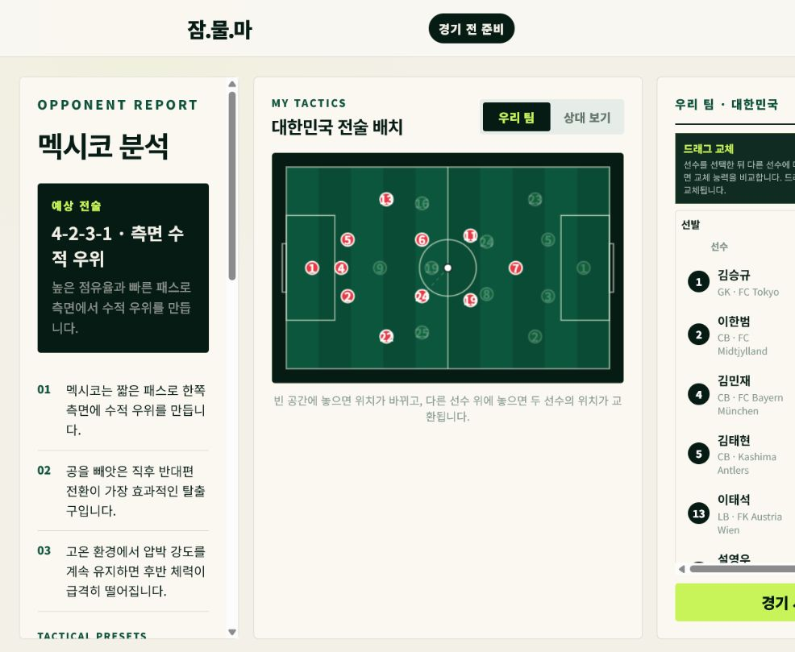
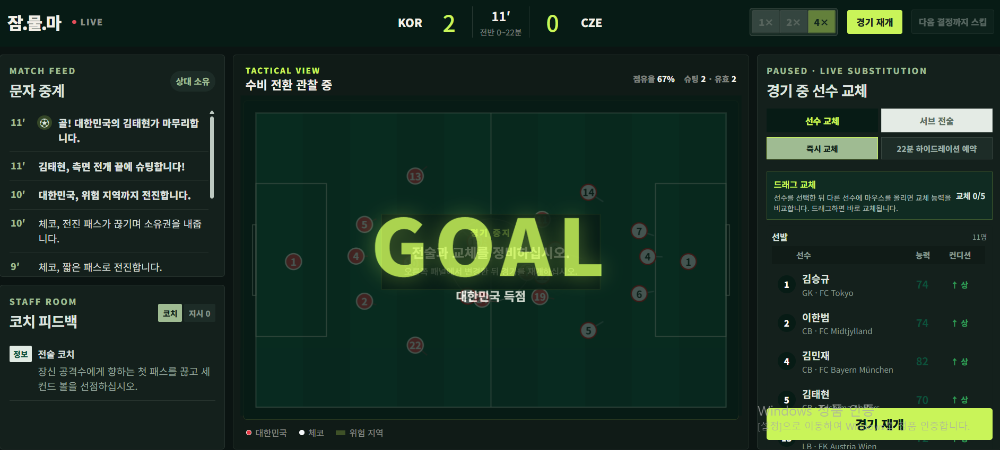
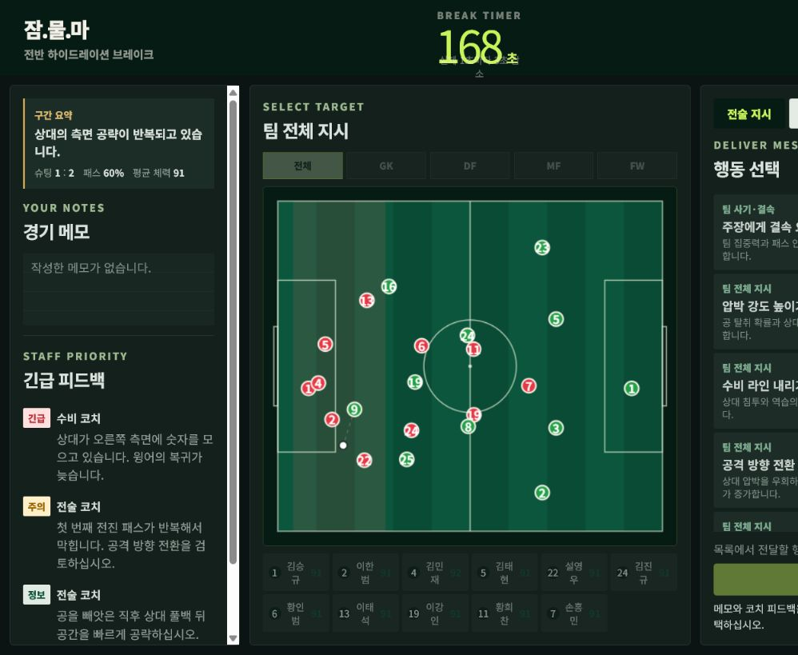
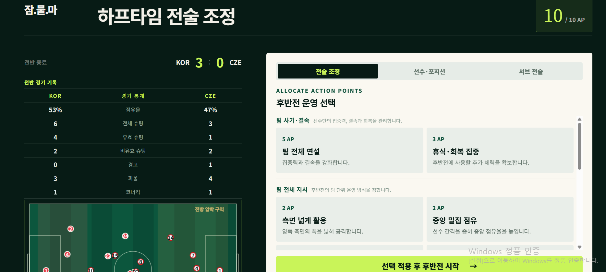
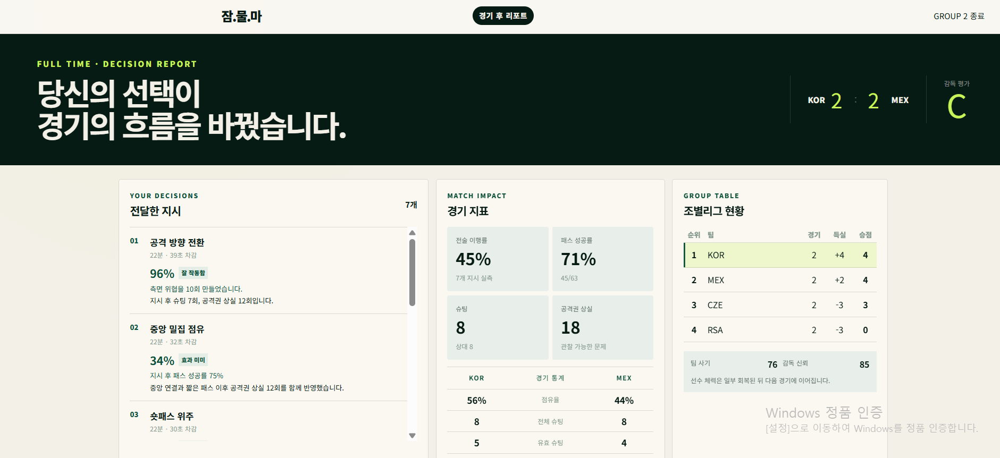

# 다음 휘슬까지

[](https://github.com/jjw712/Worldcup_dacon/actions/workflows/ci.yml)

> 다음 휘슬이 울리기 전, 경기를 바꿀 한 수.

대한민국 대표팀 감독이 되어 월드컵 조별리그 3경기를 운영하는 PC 웹 축구 감독
시뮬레이션입니다. 제한된 시간과 AP 안에서 전술, 교체와 선수 지시를 결정하며,
경기 결과는 선수 능력치·전술·체력과 시드 기반 규칙 엔진으로 계산됩니다.

## 게임 화면

### 경기 시작 전

상대 분석을 확인하고 선발 명단, 선수 위치와 주·서브 전술을 편성합니다.



### 경기 진행 중

전술판과 문자 중계, 경기 통계와 코치 피드백을 관찰합니다.



### 하이드레이션 브레이크

제한 시간 안에 팀·개인 지시, 교체와 서브 전술을 선택해 적용합니다.



### 하프타임

전반 기록을 바탕으로 AP를 배분해 후반전 운영 방식을 조정합니다.



### 경기 종료 후

전달한 지시의 효과, 경기 지표와 조별리그 순위를 확인합니다.



## 주요 기능

- 8종 전술 프리셋과 다양한 포메이션
- 선수 위치 이동, 선수 간 위치 교환과 선발·교체 명단 변경
- 선택 선수와 다른 선수의 능력치 비교
- 1×·2×·4× 경기 재생과 다음 결정 시점 스킵
- 팀 지시, 개인 지시, 서브 전술 전환과 교체 예약
- 하이드레이션 제한 시간과 하프타임 AP를 이용한 선택 시스템
- 체력, 카드, 부상, 팀 사기와 감독 신뢰의 경기 간 연계
- 경기 결과 분석, 감독 평가와 조별리그 순위
- 브라우저 자동 저장 및 진행 중인 경기 복원

## 사용법

### 바로 플레이

- [공개 버전 실행하기](https://jammulma-worldcup.andyjjw712.workers.dev)
- 권장 환경: 최신 Chrome 또는 Edge, 1280×720 이상 PC 화면
- 진행 상황은 브라우저 `localStorage`에 자동 저장됩니다.

### 게임 진행

1. 상대 보고서를 확인하고 선발, 포메이션과 주·서브 전술을 편성합니다.
2. 경기 중 전술판, 문자 중계, 통계와 코치 피드백을 관찰합니다.
3. 하이드레이션 브레이크에는 필요한 지시를 선택한 뒤 적용합니다.
4. 하프타임에는 AP를 사용해 팀·개인 지시, 교체와 위치를 조정합니다.
5. 체력과 선수 상태를 관리하며 조별리그 3경기를 완료합니다.

### 조작

| 동작 | 방법 |
| --- | --- |
| 선수 선택 | 전술판 또는 명단에서 클릭 |
| 능력 비교 | 선수를 선택한 뒤 다른 선수에 마우스 올리기 |
| 위치 이동·교환 | 선수를 빈 공간 또는 다른 선수 위로 드래그 |
| 선발·교체 변경 | 선발과 교체 명단 사이에서 클릭 또는 드래그 |
| 키보드 조작 | `Page Up`·`Page Down`으로 선택, 방향키로 이동 |
| 선택 취소 | 선택한 행동이나 서브 전술을 다시 클릭 |

GK와 필드 플레이어의 능력 비교는 가능하지만 실제 위치 교환이나 선수 교체는
할 수 없습니다.

### 로컬 실행

Node.js 22.13 이상이 필요합니다.

```bash
git clone https://github.com/jjw712/Worldcup_dacon.git
cd Worldcup_dacon
npm install
npm run dev
```

브라우저에서 `http://localhost:3000`으로 접속합니다.

```bash
# 품질 검사
npm test
npm run typecheck
npm run lint
npm run test:render

# 프로덕션 실행 및 Cloudflare 배포
npm run build
npm run start
npm run deploy:cloudflare
```

## 기술 스택

- React 19, TypeScript
- vinext, Vite
- Cloudflare Workers
- HTML Canvas 2D 전술판
- Vitest 단위·렌더 테스트

## 프로젝트 구조

```text
app/                 페이지, 메타데이터와 공통 스타일
game/components/     경기 전·경기 중·브레이크·결과 UI
game/engine/         경기 및 캠페인 규칙 엔진
game/data/           선수 데이터
worker/              Cloudflare Worker 진입점
tests/               서버 렌더링 테스트
```

## 데이터 안내

선수 명단은 프로젝트의 2026 조별리그 A조 데이터를 바탕으로 구성했습니다.
능력치와 경기 밸런스 수치는 시뮬레이션용 가상 데이터이며, 실제 선수 사진이나
공식 대회·협회 로고는 사용하지 않습니다.
